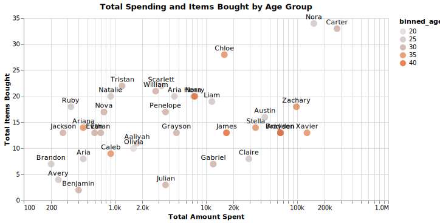
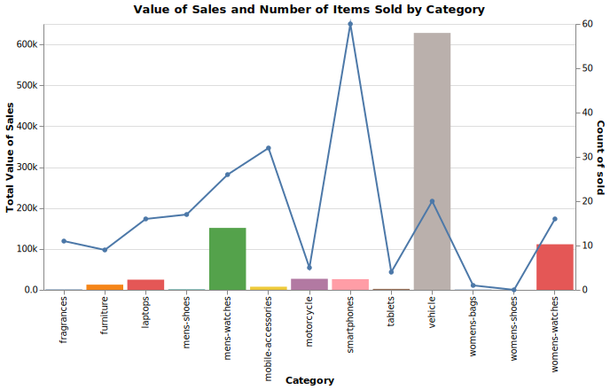

# Design and Implementation of `dummyjson_etl_dag`

## Table of Contents

- [Overview](#overview)
- [Task Definition](#task-definition)
  - [fetch](#fetch)
  - [validate](#validate)
  - [transform](#transform)
  - [upload_to_gcs](#upload_to_gcs)
  - [load_to_bigquery](#load_to_bigquery)
  - [generate_summary](#generate_summary)
- [Task Execution](#task-execution)
- [Visualizing Summary Results](#visualizing-summary-results)
  - [Save Contents of Summary Tables to CSV files](#save-contents-of-summary-tables-to-csv-files)
- [Further Considerations](#further-considerations)


## Overview

To begin our dive into the inner workings of the pipeline we'll take a look
at the Airflow DAG.


We can see that the pipeline consists of 5 separate parts. Each representing
a group of tasks responsible for a particular activity. For example
`products_etl` combines the tasks that process `products` data. Similarly
`users_etl` and `carts_etl` links tasks handle `users` and `carts` data
respectively.

On the other hand `category_summary` and `user_summary` each only contain a
single task which depend on the `<datatype>_etl` groups. The task generates a
summary using the data produced by the dependent tasks.

## Task Definition

### `fetch`

The `fetch` task expects a URL and tries to retrieve JSON data. The task
attempts to extract all the data it can find or all the data up to a limit if
if one is defined (`max_limit`). The results are written to a file and the
filename returned.

We could potentially improve this task if the resource pointed to by the API
contained a `modified_at` or `created_at` field. In this case we could filter
the values returned by the API to only those created or changed since the
previous run of the task thus reducing the total amount of data processed
during each DAG run.


### `validate`

This task ensures that some data conforms to user designated requirements. The
data is expected to be a `list` of `dict` therefore the specification is for
the individual `dict` items. Let's take the example of the `validation_spec`
for `users`:

```py
...

"users": {
    ...
    "validation_spec": {
        "id": flip(isinstance, int),
        "firstName": flip(isinstance, str),
        "lastName": flip(isinstance, str),
        "age": lambda x: isinstance(x, int) and x > 0,
        "gender": flip(isinstance, str),
        "address": {
            "address": lambda x: isinstance(x, str)
            and bool(partial(re.match, r"Street$")),
            "city": str,
            "postalCode": lambda x: isinstance(x, str)
            and bool(partial(re.match, r"[0-9]{5}")),
        },
    },
    ...
},
...
```

Each key-value pair in the spec consists of a string and a function that takes
a single argument and returns a boolean[^1]. `flip` can be thought of as
`functools.partial` that passes arguments in swapped order i.e

```py
def flip(f, x):
    return lambda y: f(y, x)
```

The spec entry `"id": flip(isinstance, int)` in the context of validating a
value `d` is equivalent to `isinstance(d["id"], int)`. Items that pass
validation are written to a file with the filename returned.

An alternative approach to validation would instead check for the validity of all
items rather than just filtering the valid ones. This would work well in
conjunction with the filtering improvement we envisioned for `fetch`.

Although this validation scheme works, it has a lot of room for improvement.
In particular errors are not handled properly. Our validations also only
handles fields that are necessary for the success of downstream tasks ignoring
everything else in the raw data. Ideally validation would instead be handled
by something such as [Pydantic][1].

Despite validation not being strictly necessary, it nonetheless enables us
to catch problems with our data early and simplify downstream tasks by
removing the need for some data related error handling.


### `transform`

This task reconstructs the raw data extracted from the API into the form
required for later analysis. The task makes use of [DuckDB][2] which allows us
to write our transformation logic in SQL. The transformations for each data
type are located in the `sql/transform_<datatype>.sql` files e.g
`sql/transform_products.sql`:

```sql
select
  id as product_id,
  title as name,
  category,
  brand,
  price
from read_json($input_file)
where price > 50
```

The results of the reconstruction are written to CSV files.


### `upload_to_gcs`

In this task the CSV file produced by the previous step is uploaded to Google Cloud
Storage. The specifics of performing the upload rely on the definition of Google
Cloud related values through environment variables as detailed in the [Usage](../README.md#usage)
section of the project README. Refer to the [documentation][3] for
usage of the Google Cloud Storage Python library.

### `load_to_bigquery`

The final task of the `<datatype>_etl` group loads the CSV file uploaded to GCS
into a BigQuery table. We pass a schema to the task that is used to define the
destination BigQuery table.

This task always overwrites any data already present in a table. It may be more
useful to change this behaviour in production to avoid clobbering still
relevant data. This behaviour is controlled by the `write_disposition`
argument of `bigquery.LoadJobConfig`. You may refer to the Google BigQuery
[documentation][4].

### `generate_summary`

This task executes SQL on BigQuery tables, saving results to a separate table.
The queries are sourced from the `sql/summarize_<topic>.sql` files. The same
consideration on overwriting tables applies as with `load_to_bigquery`.

## Task Execution

We use [Dynamic Task Mapping][5] in conjunction with [Task Groups][6] to minimize
the amount of code repetition and improve organization and flexibility. All
the different values required by tasks within ETL groups are defined in a
single dictionary (`resource_config`) keyed by the datatype.

```py
resource_config = {
    "<datatype>": {
        "api_url": "https://dummyjson.com/<datatype>",      # dummyjson resource URL
        "target": "<datatype>",                             # datatype name e.g users, products etc
        "cloud_filename": "<datatype>.csv",                 # where to store cleaned data in bucket
        "validation_spec": {                                # spec passed to `check_spec` through validate task
            ...
        },
        "bigquery_schema": [                                # schema for BigQuery table
            ...
        ],
    },
    ...
}
```
For example we could add support for `recipes` data by including the following
entry into `resource_config` and creating a `sql/transform_recipes.sql` file.

```py

"recipes": {
    "api_url": "https://dummyjson.com/recipes",
    "target": "recipes",
    "cloud_filename": "recipes.csv",
    "validation_spec": {
        "id": flip(isinstance, int),
        "name": flip(isinstance, str),
        "difficulty": flip(isinstance, str),
        "cuisine": flip(isinstance, str),
        "user_id": flip(isinstance, int),
    },
    "bigquery_schema": [
        bigquery.SchemaField("recipe_id", "INTEGER"),
        bigquery.SchemaField("name", "STRING"),
        bigquery.SchemaField("difficulty", "STRING"),
        bigquery.SchemaField("cuisine", "STRING"),
        bigquery.SchemaField("user_id", "INTEGER"),
    ],
}
```

`sql/transform_recipes.sql` could be defined as:

```sql
select
  id as recipe_id,
  name,
  difficulty,
  cuisine,
  userId as user_id
from read_json($input_file)
```

The `generate_summary` task uses values from `summary_config` in a similar
manner. The important values are:

- `summary_definition` - SQL file with query we run in BigQuery to produce the
  summary
- `bigquery_table` - the table to store query results
- `deps` - corresponds to the names of resources processed by the ETL task
  groups the summary requires. For all the tables referenced in the query
  `summary_definition` we add a dependency. For example,
  `summarize_category.sql` references `carts_table` and `products_table` which
  means it depends on `carts` and `products`.


## Visualizing Summary Results

We can visualize the results of the summaries with a few additional steps

### Save Contents of Summary Tables to CSV files

Run the following task, based on code from the [official documentation][7]

```py

from airflow.decorators import task
from google.cloud import bigquery

@task
def save_contents(table_name, output_file):
    client = bigquery.Client(project=GCP_PROJECT)
    uri = f"gs://{GCP_BUCKET}/{output_file}"
    table_id = f"{GCP_PROJECT}.{BQ_DATASET}.{table_name}"
    extract_job = client.extract_table(
        table_id,
        uri,
    )
    extract_job.result()

# save_contents('user_summary_table', 'user_summary.csv')
# save_contents('category_summary_table', 'category_summary.csv')

```

Or alternatively using the `bq` CLI:

```sh
$ source .env
$ bq extract --destination_format CSV  --field_delimiter ',' \
"${GCP_PROJECT}:${BQ_DATASET}.user_summary_table" \
"gs://${GCP_BUCKET}/user_summary.csv"
$ bq extract --destination_format CSV  --field_delimiter ',' \
"${GCP_PROJECT}:${BQ_DATASET}.category_summary_table" \
"gs://${GCP_BUCKET}/category_summary.csv"
```

After downloading both files locally, we can visualize the relationship between
age and spending by executing `visualize_user_summary` with the path to the
downloaded export of the `user_summary_table` table.




Similarly we can compare sales volume across categories using `visualize_category_summary`



## Further Considerations

1. It would be prudent to write tests for our DAG.
1. In a similar vein, setting up alerts would allows us to act on any errors
   that occur during execution.
1. We could make use of [Datasets][8] to allow other DAGs to depend on the
   results of `dummyjson_etl_dag`.


[1]: https://docs.pydantic.dev/latest/
[2]: https://duckdb.org
[3]: https://cloud.google.com/storage/docs/uploading-objects#storage-upload-object-code-sample
[4]: https://cloud.google.com/bigquery/docs/loading-data-cloud-storage-csv
[5]: https://airflow.apache.org/docs/apache-airflow/2.3.0/concepts/dynamic-task-mapping.html
[6]: https://airflow.apache.org/docs/apache-airflow/stable/core-concepts/dags.html#subdags
[7]: https://cloud.google.com/bigquery/docs/exporting-data#python
[8]: https://airflow.apache.org/docs/apache-airflow/stable/authoring-and-scheduling/datasets.html

[^1]: In addition to a function, a value in a spec can also be a nested spec
